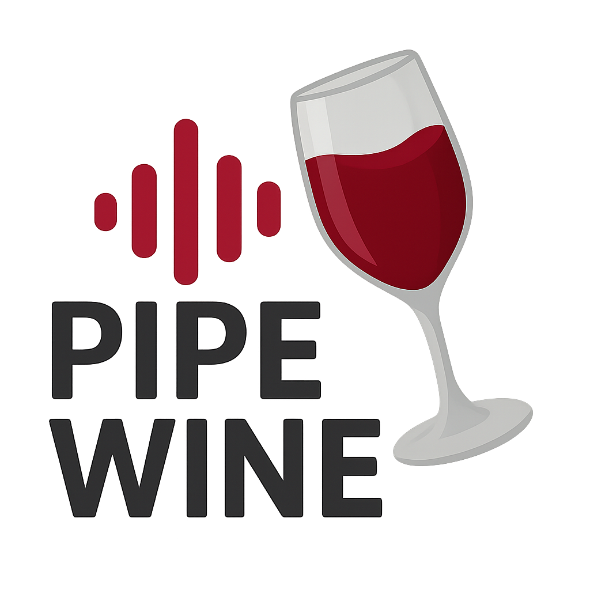

<div align="center">
  
  
  # PipeWine 🎵
  
  **Professional ASIO Driver for PipeWire on Linux**
</div>

PipeWine is a high-performance ASIO (Audio Stream Input/Output) driver that enables professional audio applications running under Wine to use PipeWire for low-latency audio processing. It provides native integration between Windows audio applications and the Linux PipeWire audio system.

[](https://github.com/yourusername/pipewine)
[](LICENSE)
[](https://www.winehq.org/)
[](https://pipewire.org/)

## ✨ Features

### 🎯 **Audio Performance**
- **Low latency** audio processing capabilities
- **Real-time audio processing** with dedicated Wine thread marshalling
- **Professional buffer management** with cache-aligned allocation
- **Manual quantum synchronization** (requires matching PipeWire and ASIO settings)

### 🎛️ **Flexible Configuration**
- **GUI control panel** (currently has issues, under development)
- **File-based configuration** system (`pipewine.conf`)
- **Real-time parameter changes** without application restart
- **Multiple configuration locations** (user and system-wide)

### 🔧 **Advanced Features**
- **Dynamic sample rate switching** (44.1kHz, 48kHz, 96kHz, 192kHz)
- **Configurable buffer sizes** (16-8192 samples, powers of 2)
- **Multiple channel configurations** (up to 64 inputs/outputs)
- **Automatic hardware connection** with device selection
- **Memory leak prevention** with comprehensive buffer management

### 🖥️ **Application Compatibility**
- **VBASIOTest64** ✅ (Tested and working)
- **Ableton Live 11** ✅ (Tested and working)
- **Other applications** ❓ (Not yet tested - compatibility unknown)

## 🚀 Quick Start

### Prerequisites
- Linux system with PipeWire
- Wine 9.0 or later
- 64-bit architecture

### Installation
```bash
# Clone the repository
git clone https://github.com/yourusername/pipewine.git
cd pipewine

# Build the driver
make 64

# Install with automatic setup
sudo ./install-pipewine.sh
```

### Basic Usage
```bash
# Test the installation
wine64 VBASIOTest64.exe

# Launch your DAW and select "PipeWine" as ASIO driver
wine64 ~/.wine/drive_c/path/to/your/daw.exe
```

## 📖 Documentation

- **[Build Instructions](BUILD.md)** - Complete building and installation guide
- **[Configuration Guide](docs/configuration.md)** - Detailed configuration options
- **[Performance Tuning](docs/performance.md)** - Optimization tips and tricks
- **[Troubleshooting](docs/troubleshooting.md)** - Common issues and solutions
- **[API Documentation](docs/api.md)** - Technical implementation details

## ⚙️ Configuration

### Quick Configuration
The driver can be configured through multiple methods:

1. **GUI Control Panel**: Access through your audio application's ASIO settings
2. **Configuration File**: Edit `~/.config/pipewine/pipewine.conf`
3. **Environment Variables**: Set `PWASIO_*` variables
4. **Registry Settings**: Use Wine registry editor

### Example Configuration
```ini
[audio]
sample_rate = 48000
buffer_size = 512
input_channels = 2
output_channels = 2

[devices]
auto_connect = true

[performance]
rt_priority = 10
```

**Important**: After changing buffer_size in configuration, set PipeWire quantum to match:
```bash
# Set PipeWire quantum to match buffer size
pw-metadata -n settings 0 clock.quantum 512
```

## 🎵 Audio Applications

### Tested Applications
| Application | Status | Notes |
|-------------|--------|-------|
| VBASIOTest64 | ✅ Working | Basic ASIO functionality confirmed |
| Ableton Live 11 | ✅ Working | Successfully tested with audio playback |

### Performance Notes
- Performance benchmarks are not yet available
- Latency depends on buffer size configuration and PipeWire quantum settings
- **Important**: PipeWire quantum must be manually set to match ASIO buffer size for optimal performance

## 🛠️ Building from Source

### Build Dependencies
```bash
# Fedora/RHEL
sudo dnf install gcc gcc-c++ make wine-devel pipewire-devel qt6-qtbase-devel

# Ubuntu/Debian  
sudo apt install build-essential wine-dev libpipewire-0.3-dev qt6-base-dev

# Arch Linux
sudo pacman -S base-devel wine pipewire qt6-base
```

### Build Commands
```bash
# 64-bit build (recommended)
make 64

# Debug build
DEBUG=true make 64

# Clean build
make clean
```

## 🐛 Troubleshooting

### Common Issues

**Q: Driver not appearing in ASIO applications**
```bash
# Re-register the driver
wine64 regsvr32 pipewine64.dll
```

**Q: High latency or audio dropouts**
```bash
# Set PipeWire quantum to match your ASIO buffer size
# For 512 sample buffer:
pw-metadata -n settings 0 clock.quantum 512

# For 256 sample buffer:
pw-metadata -n settings 0 clock.quantum 256

# Configure matching buffer size in pipewine.conf
echo "buffer_size = 512" >> ~/.config/pipewine/pipewine.conf
```

**Q: GUI not opening or has issues**
```bash
# Note: GUI currently has known issues and is under development
# For now, use configuration file or registry settings instead

# Ensure GUI library is installed (if attempting to use GUI)
sudo cp build64/libpwasio_gui.so /usr/lib64/wine/x86_64-unix/
```

## 🤝 Contributing

We welcome contributions! Please see our [Contributing Guidelines](CONTRIBUTING.md) for details.

### Development Setup
```bash
git clone https://github.com/yourusername/pipewine.git
cd pipewine
make 64
./tests/run_tests.sh
```

### Code Style
- Follow Linux kernel coding style
- Use meaningful variable names
- Add comments for complex algorithms
- Test changes thoroughly

## 📄 License

PipeWine is licensed under the [GNU Lesser General Public License v2.1](LICENSE) or later.

This allows:
- ✅ Commercial use
- ✅ Distribution
- ✅ Modification
- ✅ Patent use
- ✅ Private use

With requirements:
- 📋 License and copyright notice
- 📋 State changes
- 📋 Disclose source (for distributions)
- 📋 Same license (for modifications)

## 🙏 Acknowledgments

- **WineASIO Project** - Original ASIO implementation for Wine
- **RtAudio Project** - Cross-platform audio I/O library and inspiration
- **Wine Project** - Windows compatibility layer
- **PipeWire Team** - Modern Linux audio infrastructure
- **ASIO SDK** - Steinberg's Audio Stream I/O SDK
- **Linux Audio Community** - Continuous support and feedback

## 📞 Support

- **🐛 Bug Reports**: [GitHub Issues](https://github.com/yourusername/pipewine/issues)
- **💬 Discussions**: [GitHub Discussions](https://github.com/yourusername/pipewine/discussions)
- **📚 Documentation**: [Project Wiki](https://github.com/yourusername/pipewine/wiki)
- **📧 Email**: attax@nosinu-records.com

## 🌟 Star History

If PipeWine helps your audio workflow, please consider giving it a star! ⭐

[](https://star-history.com/#alex190291/pipewine&Date)

---

**Made with ❤️ for the Linux audio community**
