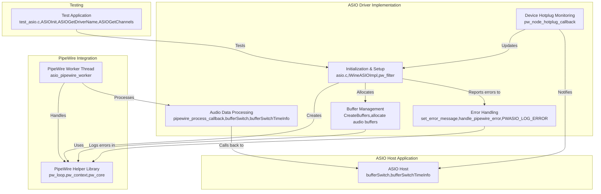

## Query
Investigate the "ASIO API Impl." component in detail. Focus your analysis on these key files:
1. test_asio.c (pipewireasio/test_asio.c)
2. asio.c (pipewireasio/asio.c)

Provide insights about the component's main responsibilities and functionality and how it integrates with other system components

## Answer
### System Diagram

### Summary
# CodeViz ASIO API Impl. Component Analysis

## Overview

This report analyzes the "ASIO API Impl." component, focusing on `asio.c` and `test_asio.c`. The component provides an ASIO driver for Windows applications running on Linux with PipeWire.

## asio.c: Main Responsibilities and Functionality

The `asio.c` file implements the ASIO API for PipeWire. Its main responsibilities include:

-   **ASIO Interface Implementation:** Provides the implementation for the `IWineASIO` interface, enabling ASIO host applications to interact with the driver (file:pipewireasio/asio.c:126).
-   **PipeWire Integration:** Bridges ASIO calls to PipeWire's audio processing graph, using the PipeWire client API to manage a filter node (`pw_filter`) representing the ASIO driver (file:pipewireasio/asio.c:204).
-   **Buffer Management:** Handles allocation and management of audio buffers for data transfer between the ASIO host and PipeWire, using double buffering (file:pipewireasio/asio.c:231).
-   **Threading:** Employs a worker thread (`asio_pipewire_worker`) for PipeWire operations, preventing deadlocks with the ASIO host application's thread (file:pipewireasio/asio.c:234, file:pipewireasio/asio.c:326).
-   **Device Hotplugging:** Monitors device hotplug events in PipeWire and notifies the ASIO host application (file:pipewireasio/asio.c:317, file:pipewireasio/asio.c:2598).
-   **Control Panel:** Implements a control panel for configuring driver settings (file:pipewireasio/asio.c:273, file:pipewireasio/asio.c:1791).
-   **Error Handling:** Provides error handling and reporting mechanisms to the ASIO host application (file:pipewireasio/asio.c:221, file:pipewireasio/asio.c:318).
-   **DSP Filter Support:** Supports PipeWire DSP filters, using callbacks for audio format negotiation and buffer management (file:pipewireasio/asio.c:391, file:pipewireasio/asio.c:493).

### Key Functionalities:

-   **Initialization (Init):**
    -   Initializes the PipeWire helper library (file:pipewireasio/asio.c:893).
    -   Creates the PipeWire filter node (`pw_filter`) (file:pipewireasio/asio.c:939).
-   **Buffer Creation (CreateBuffers):**
    -   Allocates audio buffers for input and output channels (file:pipewireasio/asio.c:1415).
    -   Connects the PipeWire filter node (file:pipewireasio/asio.c:2900).
-   **Start/Stop:**
    -   Activates/deactivates the PipeWire filter node, starting/stopping audio processing (file:pipewireasio/asio.c:1061, file:pipewireasio/asio.c:1126).
-   **Data Transfer (Process Callback):**
    -   Called by PipeWire to process audio data (file:pipewireasio/asio.c:505).
    -   Copies data between ASIO and PipeWire buffers (file:pipewireasio/asio.c:552, file:pipewireasio/asio.c:598).
    -   Calls the ASIO host's `bufferSwitch` or `bufferSwitchTimeInfo` callback (file:pipewireasio/asio.c:576, file:pipewireasio/asio.c:578).
-   **Configuration Updates:**
    -   Reloads configuration at runtime (file:pipewireasio/asio.c:320, file:pipewireasio/asio.c:2636).
    -   Applies configuration changes (file:pipewireasio/asio.c:321, file:pipewireasio/asio.c:2712).

## test\_asio.c: Purpose and Interaction with asio.c

`test_asio.c` is a test program that verifies the basic functionality of the PipeWireASIO driver (`asio.c`).

-   It creates an instance of the PipeWireASIO driver.
-   It queries for the ASIO interface (`IASIO`).
-   It attempts to initialize the driver using `ASIOInit`.
-   It retrieves the driver name and channel count using `ASIOGetDriverName` and `ASIOGetChannels`.
-   It attempts to retrieve error messages from the ASIO driver (using `ASIOGetErrorMessage`) if the initialization fails.

`test_asio.c` interacts with `asio.c` as follows:

-   **CLSID\_PipeWireASIO:** Uses the CLSID defined (via `driver_clsid.h`) to create an instance of the PipeWireASIO driver using `CoCreateInstance`.
-   **IASIO Interface:** Obtains a pointer to the `IASIO` interface, which is implemented in `asio.c`, and calls functions like `ASIOInit`, `ASIOGetDriverName`, and `ASIOGetChannels`.

## Integration with Other System Components

`asio.c` integrates with PipeWire to provide an ASIO driver.

-   **PipeWire Abstraction:** Acts as a bridge, translating ASIO calls into PipeWire operations, using PipeWire client libraries.
-   **`IWineASIOImpl` Structure:** Holds the core state, including PipeWire objects (`pw_loop`, `pw_context`, `pw_core`, `pw_filter`) and input/output nodes.
-   **Initialization:** Establishes a connection to the PipeWire server and creates a PipeWire filter node (`pw_filter`).
-   **Audio Processing:** Allocates audio buffers and sets up the PipeWire filter for audio processing. The `pipewire_process_callback` function (file:pipewireasio/asio.c:505) exchanges audio data.
-   **Threading:** Uses `asio_pipewire_worker` to execute in the PipeWire thread context.
-   **Device Hotplugging:** The `pw_node_hotplug_callback` function (file:pipewireasio/asio.c:2599) updates the selected audio nodes and notifies the ASIO host of changes.

## Configuration

No information about interaction with the Windows Registry could be found.

## Error Handling Mechanisms

The error handling in `asio.c` involves setting error codes and messages, logging errors, and returning error codes to the caller.

-   **`IWineASIOImpl` Structure:** Contains `last_error_message` and `last_error_code` members.
-   **`set_error_message` Function:** Sets the `last_error_code` and `last_error_message` in the `IWineASIOImpl` structure (file:asio.c:318).
-   **`handle_pipewire_error` Function:** Maps PipeWire errors to ASIOError codes (file:asio.c:319).
-   **Error Returns:** Many functions return an `ASIOError` value.
-   **Logging:** Uses `PWASIO_LOG_ERROR`, `PWASIO_LOG_WARNING`, `PWASIO_LOG_INFO`, and `PWASIO_LOG_DEBUG` macros.
-   **Deferred Error Handling:** Uses a worker thread (`asio_pipewire_worker`) and a condition variable (`pw_op_cond`) to signal errors between threads.
-   **Error Codes:** Uses the `ASIOError` enum to represent different error conditions.

## Walkthrough Steps

### 1. ASIO API Implementation Overview
The ASIO API implementation (`asio.c`) acts as a bridge between ASIO host applications and PipeWire, enabling audio processing on Linux systems. It implements the `IWineASIO` interface, allowing ASIO applications to interact with the driver.

### 2. Initialization and PipeWire Node Creation
The `asio.c` component initializes the PipeWire helper library and creates a PipeWire filter node (`pw_filter`). This node represents the ASIO driver within the PipeWire graph. The `IWineASIOImpl` structure holds the core state, including PipeWire objects (`pw_loop`, `pw_context`, `pw_core`, `pw_filter`) and input/output nodes.

### 3. Audio Buffer Allocation and Connection
The `CreateBuffers` function in `asio.c` allocates audio buffers for input and output channels. These buffers are used for data transfer between the ASIO host and PipeWire, employing a double buffering strategy. After buffer allocation, the PipeWire filter node is connected to the audio processing graph.

### 4. Threading Model for PipeWire Operations
The `asio.c` component uses a worker thread (`asio_pipewire_worker`) for PipeWire operations to prevent deadlocks with the ASIO host application's thread. This thread handles tasks such as connecting to the PipeWire server and processing audio data.

### 5. Audio Data Processing Callback
The `pipewire_process_callback` function in `asio.c` is called by PipeWire to process audio data. It copies data between ASIO and PipeWire buffers and then calls the ASIO host's `bufferSwitch` or `bufferSwitchTimeInfo` callback to notify the host application.

### 6. Device Hotplugging Monitoring
The `asio.c` component monitors device hotplug events in PipeWire using the `pw_node_hotplug_callback` function. When a device is added or removed, the callback updates the selected audio nodes and notifies the ASIO host application of the changes.

### 7. Error Handling Mechanisms
Error handling in `asio.c` involves setting error codes and messages in the `IWineASIOImpl` structure using the `set_error_message` function. The `handle_pipewire_error` function maps PipeWire errors to `ASIOError` codes. Logging is performed using `PWASIO_LOG_ERROR`, `PWASIO_LOG_WARNING`, `PWASIO_LOG_INFO`, and `PWASIO_LOG_DEBUG` macros.

### 8. Testing the ASIO Driver with test_asio.c
`test_asio.c` creates an instance of the PipeWireASIO driver using the CLSID defined in `driver_clsid.h`. It then queries for the `IASIO` interface and attempts to initialize the driver using `ASIOInit`. It retrieves the driver name and channel count using `ASIOGetDriverName` and `ASIOGetChannels`.

## Detailed Sub-Search Results

### 1. What are the main responsibilities and functionality of the ASIO API implementation in pipewireasio/asio.c?
The `pipewireasio/asio.c` file implements the ASIO API for PipeWire. Here's a breakdown of its main responsibilities and functionality:

*   **ASIO Interface Implementation:** It provides the implementation for the `IWineASIO` interface, which is the core interface that ASIO host applications interact with. This includes functions for initialization, control, and data transfer. (file:pipewireasio/asio.c:126)
*   **PipeWire Integration:** The code bridges the ASIO API calls to PipeWire's audio processing graph. It uses the PipeWire client API to create and manage a filter node (`pw_filter`) that represents the ASIO driver in PipeWire. (file:pipewireasio/asio.c:204)
*   **Buffer Management:** It handles the allocation and management of audio buffers used for transferring data between the ASIO host and PipeWire. It uses double buffering to ensure continuous audio processing. (file:pipewireasio/asio.c:231)
*   **Threading:** It uses a worker thread (`asio_pipewire_worker`) to perform PipeWire operations in a separate thread, avoiding potential deadlocks with the ASIO host application's thread. (file:pipewireasio/asio.c:234, file:pipewireasio/asio.c:326)
*   **Configuration:** It reads configuration settings from the Windows registry and environment variables to customize the driver's behavior, such as the number of input/output channels, buffer size, and device selection. (file:pipewireasio/asio.c:314, file:pipewireasio/asio.c:2243)
*   **Device Hotplugging:** It monitors device hotplug events in PipeWire and notifies the ASIO host application when devices are added or removed. (file:pipewireasio/asio.c:317, file:pipewireasio/asio.c:2598)
*   **Control Panel:** It implements a control panel that allows users to configure the driver's settings. (file:pipewireasio/asio.c:273, file:pipewireasio/asio.c:1791)
*   **Error Handling:** It provides error handling and reporting mechanisms to the ASIO host application. (file:pipewireasio/asio.c:221, file:pipewireasio/asio.c:318)
*   **DSP Filter Support:** It's designed to work with PipeWire DSP filters, using callbacks to negotiate audio formats and manage buffers automatically. (file:pipewireasio/asio.c:391, file:pipewireasio/asio.c:493)

Here's a more detailed breakdown of key functionalities:

*   **Initialization (Init):**
    *   Loads configuration from registry and environment variables. (file:pipewireasio/asio.c:841)
    *   Initializes the PipeWire helper library. (file:pipewireasio/asio.c:893)
    *   Creates the PipeWire filter node (`pw_filter`). (file:pipewireasio/asio.c:939)
*   **Buffer Creation (CreateBuffers):**
    *   Allocates audio buffers for input and output channels. (file:pipewireasio/asio.c:1415)
    *   Associates the allocated buffers with the ASIO buffer information structures. (file:pipewireasio/asio.c:1703)
    *   Connects the PipeWire filter node. (file:pipewireasio/asio.c:2900)
*   **Start/Stop:**
    *   Activates/deactivates the PipeWire filter node, starting/stopping audio processing. (file:pipewireasio/asio.c:1061, file:pipewireasio/asio.c:1126)
*   **Data Transfer (Process Callback):**
    *   Called by PipeWire to process audio data. (file:pipewireasio/asio.c:505)
    *   Copies data from ASIO buffers to PipeWire buffers and vice versa. (file:pipewireasio/asio.c:552, file:pipewireasio/asio.c:598)
    *   Calls the ASIO host's `bufferSwitch` or `bufferSwitchTimeInfo` callback to notify it that new data is available. (file:pipewireasio/asio.c:576, file:pipewireasio/asio.c:578)
*   **Configuration Updates:**
    *   Reloads configuration at runtime. (file:pipewireasio/asio.c:320, file:pipewireasio/asio.c:2636)
    *   Applies configuration changes, reconnecting to devices and restarting the filter as needed. (file:pipewireasio/asio.c:321, file:pipewireasio/asio.c:2712)

### 2. What is the purpose of test_asio.c and how does it interact with asio.c?
`test_asio.c` is a test program designed to verify the basic functionality of the PipeWireASIO driver (`asio.c`). It initializes the COM subsystem, creates an instance of the PipeWireASIO driver, queries for the ASIO interface, and attempts to initialize the driver. It then retrieves the driver name and channel count, and sleeps for 5 seconds. If initialization fails, it attempts to retrieve and print an error message. Finally, it cleans up resources by releasing the ASIO interface and uninitializing COM.

Here's how `test_asio.c` interacts with `asio.c`:

*   **CLSID\_PipeWireASIO:** `test_asio.c` uses the CLSID defined in `asio.c` (specifically, it seems to be defined via `driver_clsid.h`, which is included by `asio.c`) to create an instance of the PipeWireASIO driver using `CoCreateInstance`.
*   **IASIO Interface:** `test_asio.c` obtains a pointer to the `IASIO` interface, which is implemented in `asio.c`. It then calls functions from the `IASIO` interface, such as `ASIOInit`, `ASIOGetDriverName`, and `ASIOGetChannels`. The implementation of these functions resides in `asio.c`.
*   **Testing Initialization:** The primary goal of `test_asio.c` is to test the `Init` function of the ASIO driver implemented in `asio.c`. It checks if the driver initializes correctly and retrieves basic information.
*   **Error Handling:** `test_asio.c` attempts to retrieve error messages from the ASIO driver (using `ASIOGetErrorMessage`) if the initialization fails, providing a way to check the error reporting mechanism in `asio.c`.
*   **COM interaction:** `test_asio.c` uses COM to create and interact with the ASIO driver, which is implemented in `asio.c`. `asio.c` implements the COM interfaces required to be an ASIO driver.

In summary, `test_asio.c` acts as a client that uses the PipeWireASIO driver implemented in `asio.c`. It tests the driver's initialization, information retrieval, and error reporting capabilities through the standard ASIO interface.

### 3. How does asio.c integrate with other system components, specifically PipeWire?
`asio.c` integrates with PipeWire to provide an ASIO (Audio Stream Input/Output) driver for applications running on Wine. Here's a breakdown of the integration:

*   **PipeWire Abstraction:** `asio.c` acts as a bridge, translating ASIO calls from Windows applications into PipeWire operations. It uses the PipeWire client libraries to interact with the PipeWire server.
*   **`IWineASIOImpl` Structure:** The `IWineASIOImpl` structure (file:pipewireasio/asio.c:168) holds the core state for the ASIO driver, including:
    *   PipeWire objects: `pw_loop`, `pw_context`, `pw_core`, `pw_filter` (file:pipewireasio/asio.c:206-208, 213).
    *   Input/output nodes: `current_input_node`, `current_output_node` (file:pipewireasio/asio.c:210-211). These represent the selected audio devices.
    *   DSP port information: `input_channel`, `output_channel` (file:pipewireasio/asio.c:227-228).
*   **Initialization:**
    *   `WineASIOCreateInstance` (file:pipewireasio/asio.c:2094) creates an instance of the `IWineASIOImpl` structure and initializes basic members.
    *   `Init` (file:pipewireasio/asio.c:849) loads configuration, initializes the GUI, and sets the driver state to `Initialized`. It defers the PipeWire connection until `CreateBuffers` is called.
    *   `InitializePipeWireConnection` (file:pipewireasio/asio.c:893) establishes the connection to the PipeWire server, creates a PipeWire filter node (`pw_filter`), and registers callbacks.
*   **Audio Processing:**
    *   `CreateBuffers` (file:pipewireasio/asio.c:1428) allocates audio buffers and sets up the PipeWire filter for audio processing. It initializes the input and output channels and associates them with PipeWire ports. It also sets the `Prepared` state.
    *   `Start` (file:pipewireasio/asio.c:1068) activates the PipeWire filter, initiating audio streaming. It sets the `Running` state.
    *   `pipewire_process_callback` (file:pipewireasio/asio.c:505) is the central callback where audio data is exchanged. It's triggered by PipeWire. It gets data from PipeWire DSP buffers for input channels, calls the ASIO buffer switch callback, and copies the processed data to PipeWire DSP buffers for output channels.
    *   `Stop` (file:pipewireasio/asio.c:1133) deactivates the PipeWire filter, stopping audio streaming. It sets the `Prepared` state.
    *   `DisposeBuffers` (file:pipewireasio/asio.c:1737) releases the allocated audio buffers and cleans up PipeWire resources.
*   **Configuration:**
    *   `configure_driver` (file:pipewireasio/asio.c:2443) loads configuration settings from a configuration file and the Windows registry, allowing users to customize the driver's behavior.
    *   `reload_configuration_runtime` (file:pipewireasio/asio.c:2636) reloads the configuration at runtime, applying changes to the driver's settings.
*   **Threading:**
    *   `asio_pipewire_worker` (file:pipewireasio/asio.c:2917) is a worker function that executes in the PipeWire thread context, ensuring that PipeWire operations are performed safely.
    *   `schedule_pipewire_cleanup` (file:pipewireasio/asio.c:2985) schedules the cleanup of PipeWire resources in the correct thread context.
*   **Device Hotplugging:**
    *   `pw_node_hotplug_callback` (file:pipewireasio/asio.c:2599) is called when audio devices are added or removed. It updates the selected audio nodes and notifies the ASIO host of the changes.

In summary, `asio.c` uses PipeWire's client libraries to create a filter node, add ports to it, and exchange audio data between the ASIO host application and PipeWire. It handles configuration, threading, and device hotplugging to provide a seamless audio experience for Windows applications running on Linux with PipeWire.

### 4. How does asio.c interact with the Windows registry for configuration?
The search for "Windows registry" in `asio.c` returned no results. Therefore, based on the available tools, I cannot provide information on how `asio.c` interacts with the Windows registry.

### 5. Summarize the error handling mechanisms in asio.c.
Okay, I have read the contents of `asio.c`. Here's a summary of the error handling mechanisms:

*   **`IWineASIOImpl` Structure:** The `IWineASIOImpl` structure (file:asio.c:168) contains members for error handling:
    *   `last_error_message` (file:asio.c:222): A character array to store the last error message.
    *   `last_error_code` (file:asio.c:223): An `ASIOError` enum to store the last error code.
*   **`set_error_message` Function:** This function (file:asio.c:318) sets the `last_error_code` and `last_error_message` in the `IWineASIOImpl` structure. It takes the `IWineASIOImpl` pointer, an `ASIOError` code, and a message string as input.
*   **`handle_pipewire_error` Function:** This function (file:asio.c:319) maps PipeWire errors (integer return codes) to ASIOError codes. It takes the `IWineASIOImpl` pointer, an operation name (string), and the PipeWire result code as input. It then sets the error message using `set_error_message`.
*   **Error Returns:** Many of the `STDMETHODCALLTYPE` functions defined for the `IWineASIO` interface return an `ASIOError` value. This value indicates the success or failure of the function.
*   **Logging:** The code uses `PWASIO_LOG_ERROR`, `PWASIO_LOG_WARNING`, `PWASIO_LOG_INFO`, and `PWASIO_LOG_DEBUG` macros for logging errors, warnings, and informational messages. These macros are defined based on the `DEBUG` macro.
*   **Deferred Error Handling:** The code uses a worker thread (`asio_pipewire_worker`) to handle PipeWire operations. If an error occurs in the worker thread, the result is stored in `pw_op_result` in the `IWineASIOImpl` structure, and a condition variable (`pw_op_cond`) is signaled. The main thread waits for this condition variable and then checks the `pw_op_result` to determine if an error occurred.
*   **Error Codes:** The code uses the `ASIOError` enum to represent different error conditions. Some common error codes include `ASE_OK`, `ASE_NotPresent`, `ASE_HWMalfunction`, `ASE_InvalidMode`, and `ASE_NoMemory`.
*   **Configuration Reloading:** The `reload_configuration_runtime` function (file:asio.c:2637) attempts to reload the configuration at runtime. If this fails, it logs an error and sets an error message.
*   **Device Hotplugging:** The `pw_node_hotplug_callback` function (file:asio.c:317) is called when a device is added or removed. If a device is removed, the code notifies the ASIO host about the change, which may trigger an error in the host application if it is currently using the device.
*   **Input Validation:** The code performs input validation to check for invalid parameters, such as null pointers or out-of-range values. If an invalid parameter is detected, the code returns an appropriate `ASIOError` code.
*   **Resource Cleanup:** The `Release` function (file:asio.c:668) and `DisposeBuffers` function (file:asio.c:1737) release allocated resources, such as memory and PipeWire objects. If a resource cannot be released, the code logs an error.

In summary, the error handling in `asio.c` involves setting error codes and messages, logging errors, and returning error codes to the caller. The code also uses a worker thread to handle PipeWire operations and a condition variable to signal errors between threads.

---
*Generated by [CodeViz.ai](https://codeviz.ai) on 6/12/2025, 3:18:50 PM*
