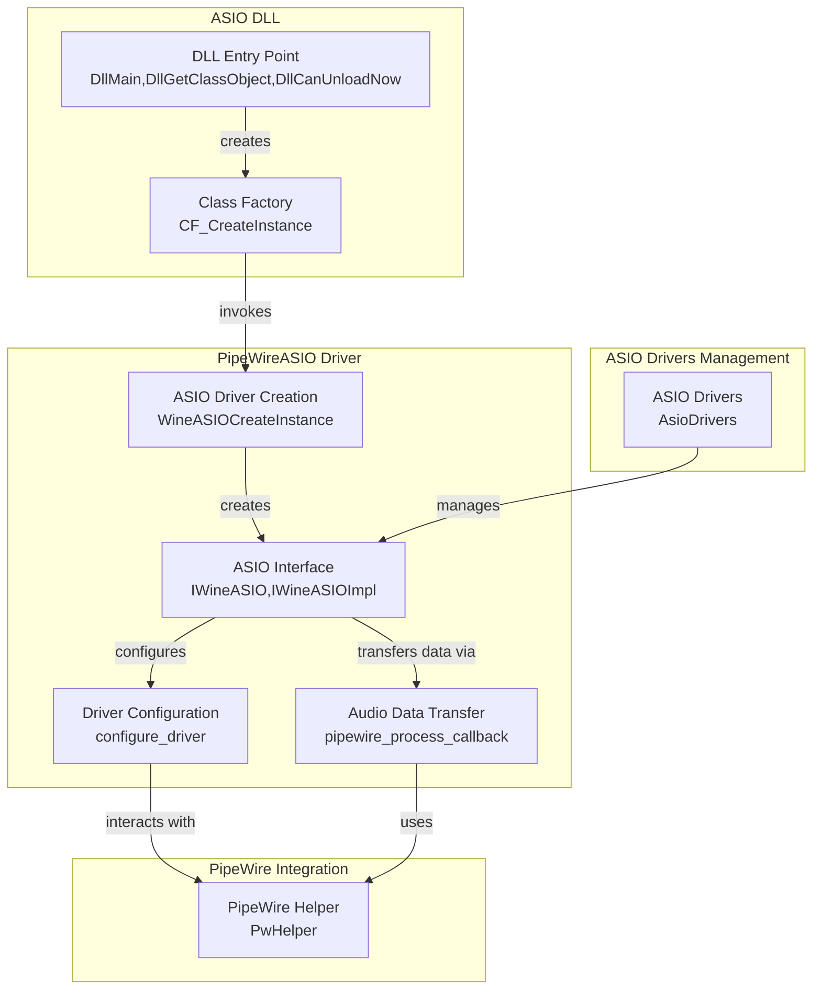

# Codebase Research Report

## Query
Investigate the "ASIO Implementation" component in detail. Focus your analysis on these key files:
1. main.c (pipewireasio/main.c)
2. asio.c (pipewireasio/asio.c)

Provide insights about the component's main responsibilities and functionality and how it integrates with other system components

## Answer
### System Diagram



### Summary
Okay, the search results confirm that `CF_CreateInstance` in `main.c` (file:pipewireasio/main.c:92) calls `WineASIOCreateInstance` (defined in `asio.c`). This is the key interaction point between these two files.

Based on the information gathered, here's a summary of the ASIO implementation:

```markdown
# CodeViz ASIO Implementation in pipewireasio

## Overview

This report details the ASIO implementation within the `pipewireasio` project, focusing on the interaction between `main.c` and `asio.c`, and how it integrates with PipeWire and ASIO-based applications.

## Key Files

-   **main.c (file:pipewireasio/main.c):** The DLL entry point, responsible for COM registration and class factory implementation.
-   **asio.c (file:pipewireasio/asio.c):** Implements the core ASIO driver logic, bridging ASIO applications with PipeWire.
-   **pw_helper.cpp (file:pipewireasio/pw_helper.cpp):** Provides a C++ helper library for simplifying interaction with PipeWire.
-   **rtaudio/include/asiodrivers.cpp (file:pipewireasio/rtaudio/include/asiodrivers.cpp):** Provides a platform-dependent way to manage ASIO drivers.

## Component Responsibilities and Functionality

### main.c

-   Serves as the DLL entry point.
-   Implements `DllGetClassObject`, `DllCanUnloadNow`, and `DllMain`, which are standard DLL functions in Windows.
-   `DllGetClassObject` is responsible for creating the class factory for the `PipeWireASIO` COM object. It uses `WineASIOCreateInstance` (defined in `asio.c`) to create an instance of the `IWineASIO` interface. (file:pipewireasio/main.c:127)
-   Includes utility functions for initializing default configurations and handling errors related to PipeWire ASIO.

### asio.c

-   Implements the core ASIO driver logic.
-   Defines the `IWineASIO` interface and its implementation (`IWineASIOImpl`). This interface exposes the ASIO functionality to client applications.
-   `WineASIOCreateInstance` (file:pipewireasio/asio.c:1874) is the function that actually creates an instance of the `IWineASIOImpl` object. This function is called by `main.c`'s `DllGetClassObject`.
-   The `IWineASIOImpl` structure contains the implementation of the ASIO methods, such as `Init`, `Start`, `Stop`, `GetChannels`, `CreateBuffers`, etc. These methods interact with PipeWire to provide audio input and output.
-   `configure_driver` (file:pipewireasio/asio.c:1897) is responsible for reading configuration settings from the registry and environment variables.
-   It sets up the PipeWire filter and adds ports for input and output.
-   The `pipewire_process_callback` (file:pipewireasio/asio.c:502) function is the core processing function that copies data between PipeWire buffers and ASIO buffers.

### pw_helper.cpp

-   Provides a C++ helper library (`PwHelper`) that simplifies interaction with PipeWire.
-   Includes functionality for:
    -   Creating and managing the PipeWire context, core, and registry.
    -   Managing PipeWire objects (nodes, metadata).
    -   Handling events from the PipeWire registry and core.
    -   Enumerating and finding PipeWire nodes.
    -   Retrieving properties of PipeWire nodes.
    -   Creating and managing a PipeWire thread loop.
    -   Loading and saving configuration settings from a file.
    -   Exposing a C API for use by other parts of the project.

### rtaudio/include/asiodrivers.cpp

-   Provides a platform-dependent way to manage ASIO drivers.
-   The `AsioDrivers` class serves as the central point for interacting with ASIO drivers.
-   Includes functions for loading, unloading, and enumerating ASIO drivers.

## Integration with Other System Components

-   **ASIO-based Applications:** `pipewireasio` acts as an ASIO driver for Windows. It implements the necessary COM interfaces (like `IClassFactory`) to be recognized as an ASIO driver by ASIO-based applications.
-   **PipeWire:** The core of the integration lies in bridging the ASIO interface with the PipeWire multimedia framework. This is facilitated by the `pw_helper.cpp` and related files.
-   **RtAudio:** The `rtaudio` directory provides a cross-platform audio I/O library that `pipewireasio` uses to handle audio input and output operations, particularly when interacting with ASIO drivers on Windows.

## Interaction Flow

1.  An ASIO-based application requests an ASIO driver.
2.  `main.c`'s `DllGetClassObject` creates the class factory for `PipeWireASIO`.
3.  The application calls `CF_CreateInstance` on the class factory, which in turn calls `WineASIOCreateInstance` (file:pipewireasio/main.c:92) in `asio.c` to create an instance of the `IWineASIO` interface.
4.  `asio.c` uses the `PwHelper` class from `pw_helper.cpp` to connect to the PipeWire server and manage audio streams.
5.  `asiodrivers.cpp` (within `rtaudio`) is used to load and manage the ASIO drivers.
6.  Audio data is transferred between the ASIO application and PipeWire via the `pipewire_process_callback` function in `asio.c` (file:pipewireasio/asio.c:502).
```

## Walkthrough Steps

### 1. ASIO Implementation Overview
The `pipewireasio` component acts as a bridge between ASIO-based applications and the PipeWire multimedia framework. It allows ASIO applications to utilize PipeWire for audio input and output on Windows. The core interaction starts when an ASIO application requests an ASIO driver, leading to the creation of the `PipeWireASIO` COM object.

### 2. DLL Entry Point and Class Factory Creation in `main.c`
The `main.c` file serves as the DLL entry point for the `pipewireasio` component. It implements standard DLL functions like `DllGetClassObject`, `DllCanUnloadNow`, and `DllMain`. The `DllGetClassObject` function is crucial as it creates the class factory for the `PipeWireASIO` COM object, enabling ASIO applications to discover and utilize the driver.

### 3. Interaction between `main.c` and `asio.c` via `WineASIOCreateInstance`
When an ASIO application requests an instance of the `PipeWireASIO` driver, the class factory's `CF_CreateInstance` method is invoked. This method, in turn, calls `WineASIOCreateInstance` (defined in `asio.c`). This call is the primary interaction point between `main.c` and `asio.c`, initiating the creation of the core ASIO driver instance.

### 4. Core ASIO Driver Logic in `asio.c`
The `asio.c` file implements the core ASIO driver logic. It defines the `IWineASIO` interface and its implementation, `IWineASIOImpl`. The `WineASIOCreateInstance` function creates an instance of the `IWineASIOImpl` object, which exposes the ASIO functionality to client applications. This instance contains the implementation of ASIO methods like `Init`, `Start`, `Stop`, `GetChannels`, and `CreateBuffers`.

### 5. Driver Configuration via `configure_driver`
Within `asio.c`, the `configure_driver` function reads configuration settings from the registry and environment variables. It sets up the PipeWire filter and adds ports for input and output, configuring the driver's behavior based on system settings. This function is essential for adapting the driver to different environments and user preferences.

### 6. Audio Data Transfer via `pipewire_process_callback`
The `pipewire_process_callback` function in `asio.c` is the core processing function responsible for transferring audio data between PipeWire buffers and ASIO buffers. This function is the heart of the integration, ensuring seamless audio data flow between the ASIO application and the PipeWire server.

### 7. PipeWire Interaction with `PwHelper`
The `pw_helper.cpp` file provides a C++ helper library (`PwHelper`) that simplifies interaction with PipeWire. It encapsulates functionalities such as creating and managing the PipeWire context, core, and registry, handling events, enumerating nodes, and managing a PipeWire thread loop. This library abstracts away the complexities of interacting with PipeWire directly.

### 8. ASIO Driver Management with `AsioDrivers`
The `rtaudio/include/asiodrivers.cpp` file provides a platform-dependent way to manage ASIO drivers. The `AsioDrivers` class serves as the central point for interacting with ASIO drivers, including functions for loading, unloading, and enumerating them. This component is crucial for managing the available ASIO drivers on the system.

## Detailed Sub-Search Results

### 1. What is the main functionality of asio.c in the pipewireasio project?
The `asio.c` file implements the IWineASIO interface, providing an ASIO driver for PipeWire. It allows applications using the ASIO interface to connect to and use PipeWire for audio input and output.

Here's a breakdown of its main functionalities:

*   **Implements the ASIO interface:** It provides the necessary functions (Init, GetChannels, Start, Stop, CreateBuffers, etc.) to act as an ASIO driver. These functions are called by ASIO-aware applications. (file:asio.c:123)
*   **Manages PipeWire connections:** It uses the PipeWire client library to connect to the PipeWire server, create a filter node, and manage audio buffers. (file:asio.c:202)
*   **Handles audio buffer transfers:** It copies audio data between ASIO buffers (used by the application) and PipeWire buffers. (file:asio.c:532, file:asio.c:576)
*   **Configuration:** It reads configuration from a file and the Windows registry to determine the number of input/output channels, buffer size, and other settings. It also allows overriding these settings with environment variables. (file:asio.c:1897)
*   **GUI Control Panel:** It provides a control panel for configuring the driver settings. (file:asio.c:1591)
*   **Threading:** It handles thread creation for callbacks. (file:asio.c:1746)

In essence, `asio.c` acts as a bridge between ASIO-based audio applications and the PipeWire audio server.

### 2. What is the main functionality of main.c in the pipewireasio project?
The `main.c` file in the pipewireasio project serves as the entry point for the DLL. Here's a breakdown of its main functionalities:

*   **DLL Entry Point (`DllMain`)**: This function is the standard DLL entry point, handling DLL initialization and termination. It doesn't perform any significant actions other than returning `TRUE`. (file:main.c:172)
*   **Class Factory Implementation**: It implements the `IClassFactory` interface to create instances of the PipeWireASIO driver. This involves:
    *   Defining the `IClassFactoryImpl` structure and its virtual table (`CF_Vtbl`). (file:main.c:36)
    *   Implementing methods for `QueryInterface`, `AddRef`, `Release`, `CreateInstance`, and `LockServer` for the class factory. (file:main.c:47)
    *   The `CF_CreateInstance` function calls `WineASIOCreateInstance` to actually create the WineASIO object. (file:main.c:92)
*   **`DllGetClassObject`**: This function is called by COM to retrieve the class factory for the PipeWireASIO driver. It checks if the requested CLSID is `CLSID_PipeWireASIO` and returns the `WINEASIO_CF` class factory if it matches. (file:main.c:127)
*   **`DllCanUnloadNow`**: This function determines whether the DLL can be unloaded from memory. It checks the reference count of the class factory. (file:main.c:164)
*   **Configuration Utility Functions**: It includes functions for initializing the default configuration, providing error strings, and validating buffer sizes and sample rates. (file:main.c:200)

In essence, `main.c` provides the necessary COM infrastructure to allow the pipewireasio DLL to be loaded and used as an ASIO driver within Windows audio applications. It also contains helper functions for configuration.

### 3. How do main.c and asio.c interact in the pipewireasio project?
The interaction between `main.c` and `asio.c` in the `pipewireasio` project can be summarized as follows:

*   **`main.c` (file:pipewireasio/main.c)**:
    *   Serves as the entry point for the DLL.
    *   Implements `DllGetClassObject`, `DllCanUnloadNow`, and `DllMain`, which are standard DLL functions in Windows.
    *   `DllGetClassObject` is responsible for creating the class factory for the `PipeWireASIO` COM object. It uses `WineASIOCreateInstance` (defined in `asio.c`) to create an instance of the `IWineASIO` interface.
    *   Includes utility functions for initializing default configurations and handling errors related to PipeWire ASIO.
*   **`asio.c` (file:pipewireasio/asio.c)**:
    *   Implements the core ASIO driver logic.
    *   Defines the `IWineASIO` interface and its implementation (`IWineASIOImpl`). This interface exposes the ASIO functionality to client applications.
    *   `WineASIOCreateInstance` (file:pipewireasio/asio.c:1874) is the function that actually creates an instance of the `IWineASIOImpl` object. This function is called by `main.c`'s `DllGetClassObject`.
    *   The `IWineASIOImpl` structure contains the implementation of the ASIO methods, such as `Init`, `Start`, `Stop`, `GetChannels`, `CreateBuffers`, etc. These methods interact with PipeWire to provide audio input and output.
    *   `configure_driver` (file:pipewireasio/asio.c:1897) is responsible for reading configuration settings from the registry and environment variables.
    *   It sets up the PipeWire filter and adds ports for input and output.
    *   The `pipewire_process_callback` (file:pipewireasio/asio.c:502) function is the core processing function that copies data between PipeWire buffers and ASIO buffers.

In essence, `main.c` provides the DLL entry points and class factory, while `asio.c` implements the actual ASIO driver functionality using PipeWire. `main.c` calls a function in `asio.c` to create the main COM object.

### 4. How does the pipewireasio component integrate with other system components, specifically PipeWire and ASIO-based applications?
Based on the file analysis, here's how `pipewireasio` integrates with other system components, focusing on PipeWire and ASIO applications:

*   **ASIO Driver Emulation:** `pipewireasio` acts as an ASIO driver for Windows. It implements the necessary COM interfaces (like `IClassFactory`) to be recognized as an ASIO driver by ASIO-based applications. The `DllGetClassObject` function (file:pipewireasio/main.c:127) is the entry point for creating instances of the `PipeWireASIO` driver.
*   **PipeWire Interaction:** The core of the integration lies in bridging the ASIO interface with the PipeWire multimedia framework. This is facilitated by the `pw_helper.cpp` (file:pipewireasio/pw_helper.cpp) and related files (`pw_helper.hpp`, `pw_helper_c.h`, `pw_helper_common.h`). These files provide functions to:
    *   Connect to the PipeWire server (`pw_context_connect` in file:pipewireasio/pw_helper.cpp:792).
    *   Create a PipeWire context and core (`pw_context_new`, `pw_core_get_registry` in file:pipewireasio/pw_helper.cpp).
    *   Register as a PipeWire client.
    *   Enumerate existing PipeWire nodes (audio endpoints) and bind to them (`pw_registry_bind` in file:pipewireasio/pw_helper.cpp:680).
    *   Manage PipeWire threads and main loops (`pw_thread_loop_new`, `pw_thread_loop_start` in file:pipewireasio/pw_helper.cpp).
    *   Handle PipeWire events related to node creation, removal, and property changes.
*   **Configuration:** The `pw_asio_load_config` function (file:pipewireasio/pw_helper.cpp:962) reads configuration settings from a file, allowing users to specify parameters like sample rate, buffer size, and device names. This configuration is then used to initialize the PipeWire connection and ASIO driver.
*   **pw_thread.inc.cpp:** (file:pipewireasio/pw_thread.inc.cpp) This file seems to contain implementation details related to thread management within the PipeWire context.
*   **ASIO Drivers (asiodrivers.cpp):** (file:pipewireasio/rtaudio/include/asiodrivers.cpp) This file handles the loading of ASIO drivers.

In essence, `pipewireasio` presents itself as a standard ASIO driver to applications. Internally, it uses the PipeWire client libraries to connect to a PipeWire server, discover audio devices, and stream audio data between the ASIO application and PipeWire.

### 5. Summarize the role of pw_helper.cpp in the pipewireasio project.
pw_helper.cpp provides a C++ helper library (`PwHelper`) that simplifies interaction with PipeWire. It includes functionality for:

*   **Initialization and Connection:** Creating and managing the PipeWire context, core, and registry. This includes setting client properties and connecting to the PipeWire server (`create_helper` function) (file:pipewireasio/pw_helper.cpp:750).
*   **Object Management:** Managing PipeWire objects (nodes, metadata) through proxy objects and tracking them in a map (`bound_proxies`).
*   **Event Handling:** Handling events from the PipeWire registry (global object add/remove) and core (roundtrip completion).
*   **Node Discovery:** Enumerating and finding PipeWire nodes by name or by default designation (source/sink).
*   **Property Access:** Retrieving properties of PipeWire nodes.
*   **Thread Management:** Creating and managing a PipeWire thread loop.
*   **Configuration:** Loading and saving configuration settings from a file (`pw_asio_load_config` and `pw_asio_save_config`) (file:pipewireasio/pw_helper.cpp:962, file:pipewireasio/pw_helper.cpp:1006).
*   **C API:** Exposing a C API for use by other parts of the project.

In essence, `pw_helper.cpp` encapsulates the low-level PipeWire API calls and provides a higher-level, object-oriented interface for managing PipeWire connections and objects within the pipewireasio project. It also handles configuration loading and saving.

### 6. What is the role of rtaudio in the pipewireasio project?
I couldn't find any occurrences of "rtaudio pipewireasio" in the codebase. It's possible that rtAudio is not directly mentioned in the codebase or documentation. To provide a more accurate answer, I need more information or context. Could you provide more details about where you encountered this term or what you're trying to understand about its role?

### 7. What is the role of the rtaudio directory and its contents within the pipewireasio project?
The `rtaudio` directory in the `pipewireasio` project contains the RtAudio library. RtAudio is a set of C++ classes that provide a unified API for real-time audio input/output across various operating systems, including Linux, macOS, and Windows. It supports multiple audio APIs like ALSA, JACK, CoreAudio, DirectSound, ASIO, and WASAPI.

The `rtaudio` directory includes:

*   **`cmake`**: CMake-related files for RtAudio.
*   **`contrib`**: Contains contributions, including Go and Python bindings for RtAudio.
*   **`doc`**: Documentation for RtAudio, including a Doxygen configuration and API notes.
*   **`include`**: Header files required for ASIO, DirectSound, and OSS compilation.
*   **`tests`**: Example RtAudio programs and test suites.
*   **Source files**: `RtAudio.cpp`, `RtAudio.h`, `rtaudio_c.cpp`, `rtaudio_c.h` which implement the core RtAudio functionality.
*   **Build-related files**: `CMakeLists.txt`, `configure.ac`, `Makefile.am`, `autogen.sh`, and `rtaudio.pc.in`.

The primary role of the `rtaudio` directory is to provide a cross-platform audio I/O library that `pipewireasio` likely uses to handle audio input and output operations, particularly when interacting with ASIO drivers on Windows.

### 8. Summarize the functionality of asiodrivers.cpp in pipewireasio/rtaudio/include/
The file `pipewireasio/rtaudio/include/asiodrivers.cpp` provides an implementation for loading and managing ASIO drivers. Here's a breakdown of its functionality, conditional on the operating system:

**Overall Purpose:**

The primary goal of this file is to abstract the process of loading, unloading, and managing ASIO drivers, providing a consistent interface across different operating systems. It defines the `AsioDrivers` class, which encapsulates the driver management logic.

**Key Functionality:**

*   **Driver Loading:** The `loadDriver(char *name)` function attempts to load an ASIO driver with the given name. The implementation varies depending on the OS.
*   **Driver Unloading:** The `removeCurrentDriver()` function unloads the currently loaded ASIO driver.
*   **Driver Enumeration:** The `getDriverNames(char **names, long maxDrivers)` function retrieves a list of available ASIO driver names.
*   **Current Driver Name:** The `getCurrentDriverName(char *name)` retrieves the name of the currently loaded driver.

**Platform-Specific Implementations:**

*   **macOS (`#if MAC`):**
    *   Uses `CodeFragments` to manage ASIO drivers.
    *   Relies on `resolveASIO(unsigned long aconnID)` to resolve the ASIO driver connection.
*   **Windows (`#elif WINDOWS`):**
    *   Uses the `iasiodrv.h` header.
    *   Uses `asioOpenDriver`, `asioCloseDriver`, and `asioGetDriverName` functions to interact with ASIO drivers.
    *   Maintains a global `theAsioDriver` pointer to the currently loaded `IASIO` interface.
*   **SGI/BeOS (`#elif SGI || BEOS`):**
    *   Includes `asiolist.h`.
    *   Provides empty implementations for most functions, effectively disabling ASIO driver support.
*   **Other Platforms (`#else`):**
    *   Raises a compilation error, indicating that the code needs to be implemented for the target platform.

**Key Class:**

*   **`AsioDrivers`:** This class is the core of the file. It manages the loading, unloading, and enumeration of ASIO drivers. It contains methods for:
    *   Loading a driver (`loadDriver`).
    *   Unloading the current driver (`removeCurrentDriver`).
    *   Getting the names of available drivers (`getDriverNames`).
    *   Getting the name of the current driver (`getCurrentDriverName`).

In summary, `asiodrivers.cpp` provides a platform-dependent way to manage ASIO drivers, with different implementations for macOS, Windows, and (partially) SGI/BeOS. The `AsioDrivers` class serves as the central point for interacting with ASIO drivers.

---
*Generated by [CodeViz.ai](https://codeviz.ai) on 6/12/2025, 6:10:41 AM*
