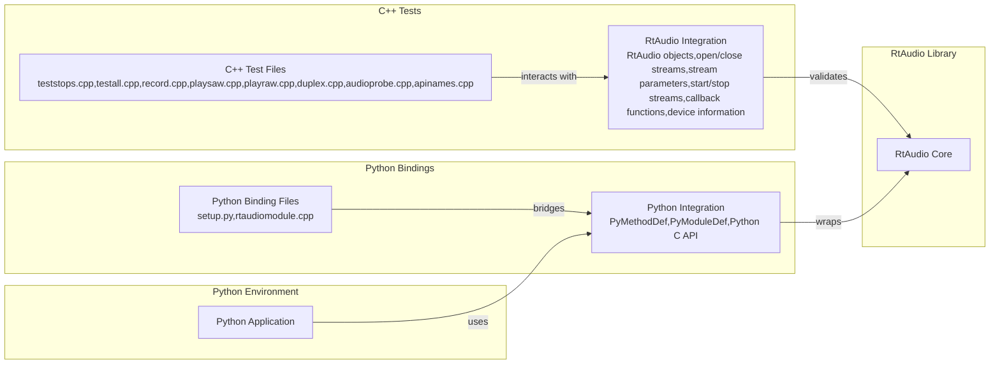

# Codebase Research Report

## Query
Investigate the "Language Bindings & Tests" component in detail. Focus your analysis on these key files:
1. teststops.cpp (pipewireasio/rtaudio/tests/teststops.cpp)
2. testall.cpp (pipewireasio/rtaudio/tests/testall.cpp)
3. record.cpp (pipewireasio/rtaudio/tests/record.cpp)
4. playsaw.cpp (pipewireasio/rtaudio/tests/playsaw.cpp)
5. playraw.cpp (pipewireasio/rtaudio/tests/playraw.cpp)
6. duplex.cpp (pipewireasio/rtaudio/tests/duplex.cpp)
7. audioprobe.cpp (pipewireasio/rtaudio/tests/audioprobe.cpp)
8. apinames.cpp (pipewireasio/rtaudio/tests/apinames.cpp)
9. setup.py (pipewireasio/rtaudio/contrib/python/pyrtaudio/setup.py)
10. rtaudiomodule.cpp (pipewireasio/rtaudio/contrib/python/pyrtaudio/rtaudiomodule.cpp)

Provide insights about the component's main responsibilities and functionality and how it integrates with other system components

## Answer
### System Diagram



### Summary
# CodeViz: Language Bindings & Tests Component Analysis

## Overview

This report analyzes the "Language Bindings & Tests" component of the RtAudio library, focusing on the provided C++ test files and Python binding files. The analysis aims to provide insights into the component's responsibilities, functionality, and integration with other system components.

## C++ Tests Analysis

The C++ test files located in `(file:pipewireasio/rtaudio/tests)` directory are designed to validate the functionality of the RtAudio library. Each file focuses on testing specific aspects of the library.

### Test File Summaries

-   **teststops.cpp** (file:pipewireasio/rtaudio/tests/teststops.cpp): Tests the `startStream()`, `stopStream()`, `abortStream()`, `openStream()`, and `closeStream()` methods of the RtAudio class.
-   **testall.cpp** (file:pipewireasio/rtaudio/tests/testall.cpp): Extensively tests various aspects of the RtAudio library, including stream operations, data handling, and stream options.
-   **record.cpp** (file:pipewireasio/rtaudio/tests/record.cpp): Records audio data from a specified input device and writes it to a raw file.
-   **playsaw.cpp** (file:pipewireasio/rtaudio/tests/playsaw.cpp): Generates sawtooth waveforms and outputs them to an audio device.
-   **playraw.cpp** (file:pipewireasio/rtaudio/tests/playraw.cpp): Plays a raw audio file using RtAudio.
-   **duplex.cpp** (file:pipewireasio/rtaudio/tests/duplex.cpp): Demonstrates a simple duplex (input and output) stream using RtAudio.
-   **audioprobe.cpp** (file:pipewireasio/rtaudio/tests/audioprobe.cpp): Probes the audio system and prints information about available audio devices.
-   **apinames.cpp** (file:pipewireasio/rtaudio/tests/apinames.cpp): Tests the RtAudio API name functionality.

### Integration with RtAudio Library

These test files directly interact with the RtAudio library by:

-   Creating RtAudio objects.
-   Opening and closing audio streams.
-   Setting stream parameters (e.g., sample rate, number of channels, data format).
-   Starting and stopping audio streams.
-   Providing callback functions for audio processing.
-   Querying audio device information.

## Python Bindings Analysis

The Python binding files located in `(file:pipewireasio/rtaudio/contrib/python/pyrtaudio)` directory provide a Python interface to the RtAudio library.

### File Summaries

-   **setup.py** (file:pipewireasio/rtaudio/contrib/python/pyrtaudio/setup.py): A standard Python setup script used to build, distribute, and install the `rtaudio` Python extension module. It specifies the source files to be compiled, including `rtaudiomodule.cpp` and the RtAudio C++ source files.
-   **rtaudiomodule.cpp** (file:pipewireasio/rtaudio/contrib/python/pyrtaudio/rtaudiomodule.cpp): Acts as a bridge between the RtAudio C++ library and Python. It defines Python functions that wrap RtAudio functions, handling argument parsing, type conversion, error handling, and memory management. It also implements a callback mechanism to handle audio processing in Python.

### Integration with RtAudio Library and Python

The Python bindings integrate with the RtAudio library by:

-   Wrapping RtAudio functions with Python functions.
-   Using the Python C API to interact with Python objects.
-   Defining a `PyMethodDef` array to map Python function names to C wrapper functions.
-   Defining a `PyModuleDef` structure to describe the module to the Python interpreter.
-   Implementing a callback mechanism to handle audio processing in Python.

The Python bindings allow Python applications to:

-   Access RtAudio's audio I/O capabilities.
-   Enumerate audio devices.
-   Open and close audio streams.
-   Record and play audio data.
-   Process audio data in real-time using Python callback functions.

## Walkthrough Steps

### 1. Language Bindings & Tests Component Overview
The "Language Bindings & Tests" component validates the `RtAudio` library's functionality and provides a Python interface. The C++ tests ensure the `RtAudio` library functions correctly, while the Python bindings allow Python applications to use `RtAudio`'s audio I/O capabilities.

### 2. C++ Tests Functionality
The C++ test files validate the `RtAudio` library. `teststops.cpp` tests stream control methods like `startStream()` and `stopStream()`. `testall.cpp` extensively tests stream operations and data handling. `record.cpp` records audio to a raw file. `playsaw.cpp` generates sawtooth waveforms. `playraw.cpp` plays a raw audio file. `duplex.cpp` demonstrates duplex streams. `audioprobe.cpp` probes the audio system. `apinames.cpp` tests API name functionality.

### 3. C++ Tests Integration with RtAudio
The C++ tests interact with the `RtAudio` library by creating `RtAudio` objects, opening and closing audio streams, setting stream parameters (sample rate, channels, format), starting and stopping streams, providing callback functions, and querying device information.

### 4. Python Bindings Functionality
The Python bindings provide a Python interface to `RtAudio`. `setup.py` builds and installs the `rtaudio` Python extension. `rtaudiomodule.cpp` bridges `RtAudio` and Python, wrapping `RtAudio` functions, handling argument parsing and type conversion, and implementing a callback mechanism.

### 5. Python Bindings Integration with RtAudio and Python
The Python bindings integrate with `RtAudio` by wrapping C++ functions with Python functions using the Python C API. A `PyMethodDef` array maps Python function names to C wrapper functions, and a `PyModuleDef` structure describes the module to the Python interpreter. This allows Python applications to access `RtAudio`'s audio I/O, enumerate devices, open streams, record/play audio, and process audio using Python callbacks.

## Detailed Sub-Search Results

### 1. Summarize the purpose and functionality of the C++ test files: teststops.cpp, testall.cpp, record.cpp, playsaw.cpp, playraw.cpp, duplex.cpp, audioprobe.cpp, and apinames.cpp. Focus on what aspects of the RtAudio library they are testing.
Okay, I have analyzed the provided list of C++ test files and summarized their purpose and functionality, focusing on the aspects of the RtAudio library they test.

*   **teststops.cpp:** This test file focuses on rigorously testing the `startStream()`, `stopStream()`, `abortStream()`, `openStream()`, and `closeStream()` methods of the RtAudio class. It performs these operations in various sequences and combinations, including:
    *   Repeatedly starting and stopping a stream externally using `stopStream()`.
    *   Stopping a stream internally by returning a value from the callback function.
    *   Aborting a stream internally using a callback return value.
    *   Consecutively re-opening streams.
    *   Consecutively creating and deleting RtAudio instances along with their streams.
    *   It tests duplex stream functionality.
*   **testall.cpp:** This file aims to extensively test various aspects of the RtAudio library. It covers:
    *   Basic stream opening, starting, stopping, and aborting.
    *   Interleaved and non-interleaved audio data handling.
    *   Duplex stream operation (both input and output).
    *   Setting stream options like `RTAUDIO_HOG_DEVICE` and `RTAUDIO_NONINTERLEAVED`.
    *   Retrieving stream latency using `getStreamLatency()`.
*   **record.cpp:** This program focuses on recording audio data using RtAudio. It:
    *   Opens an input stream using `openStream()`.
    *   Records audio data from a specified input device for a given duration.
    *   Writes the recorded audio data to a header-less binary file named "record.raw".
    *   Supports different audio data formats (SINT8, SINT16, SINT24, SINT32, FLOAT32, FLOAT64).
    *   Uses a callback function (`input`) to receive the audio data.
*   **playsaw.cpp:** This program generates sawtooth waveforms using RtAudio. It:
    *   Outputs sawtooth waveforms of different frequencies on each channel.
    *   Allows specifying the number of channels, sample rate, output device, and channel offset.
    *   Supports both interleaved and non-interleaved audio data.
    *   Demonstrates the use of `RTAUDIO_HOG_DEVICE` and `RTAUDIO_SCHEDULE_REALTIME` stream options.
    *   Includes an example error callback function.
    *   Tests the `getStreamLatency()` function.
*   **playraw.cpp:** This program plays a raw audio file using RtAudio. It:
    *   Reads audio data from a specified raw file.
    *   Outputs the audio data to a specified output device.
    *   Requires the raw file to be in a specific data format (defined in the code).
    *   Uses a callback function (`output`) to provide audio data to the stream.
    *   Supports different audio data formats (SINT8, SINT16, SINT24, SINT32, FLOAT32, FLOAT64).
*   **duplex.cpp:** This program demonstrates a simple duplex (input and output) stream using RtAudio. It:
    *   Opens both an input and an output stream.
    *   Copies the input directly to the output, creating a "pass-through" effect.
    *   Allows specifying different input and output devices and channel offsets.
    *   Tests the `getStreamLatency()` function for a duplex stream.
    *   Supports different audio data formats (SINT8, SINT16, SINT24, SINT32, FLOAT32, FLOAT64).
*   **audioprobe.cpp:** This program is designed to probe the audio system and print information about available audio devices. It:
    *   Retrieves and prints the RtAudio version.
    *   Lists the compiled audio APIs (e.g., ALSA, CoreAudio, ASIO).
    *   Iterates through available audio devices and prints their properties, including:
        *   Device name and ID.
        *   Probe status (success or failure).
        *   Number of input, output, and duplex channels.
        *   Whether the device is the default input or output device.
        *   Natively supported data formats (e.g., 8-bit int, 32-bit float).
        *   Supported sample rates.
*   **apinames.cpp:** This program tests the RtAudio API name functionality. It:
    *   Tests the conversion between API identifiers (e.g., `RtAudio::MACOSX_CORE`) and their corresponding names (e.g., "OS-X Core Audio") using `RtAudio::getApiName()` and `RtAudio::getApiDisplayName()`.
    *   Tests the retrieval of API identifiers by name using `RtAudio::getCompiledApiByName()`.
    *   Verifies that invalid API identifiers and names return appropriate empty strings or `RtAudio::UNSPECIFIED` values.
    *   Tests both the C++ and C interfaces for API name handling.

### 2. Summarize the purpose and functionality of the Python binding files: setup.py and rtaudiomodule.cpp. Focus on how they expose RtAudio functionality to Python.
Okay, I will summarize the purpose and functionality of `setup.py` and `rtaudiomodule.cpp`, focusing on how they expose RtAudio functionality to Python. I'll aim for a mid-level of abstraction.

1.  **Analyze Sub-Query & Abstraction Level:** The query asks for the purpose and functionality of two specific files, `setup.py` and `rtaudiomodule.cpp`, with a focus on how they expose RtAudio functionality to Python. This implies a mid-level of abstraction, requiring me to identify key functions, data structures, and interactions between the C++ RtAudio library and the Python interface.

2.  **Tool Usage Plan:**
    *   `read_file` to understand the contents of `setup.py` and `rtaudiomodule.cpp`.
    *   `text_search` within `rtaudiomodule.cpp` for keywords like "PyMethodDef", "PyModuleDef", "RtAudio", and "callback" to identify how RtAudio functions are wrapped and exposed to Python.

3.  **Execution & Output:**

```text
- **setup.py** (file:setup.py):
  - Purpose: This file is a standard Python setup script used by `distutils` or `setuptools` to build, distribute, and install the `rtaudio` Python extension module.
  - Functionality:
    - It defines the module name (`rtaudio`).
    - It specifies the source files to be compiled, including `rtaudiomodule.cpp` (the Python wrapper) and the RtAudio C++ source files.
    - It configures the compiler and linker settings needed to build the extension, including specifying include directories for RtAudio headers.
    - It uses the `Extension` class from `setuptools` to define the extension module and its build parameters.
    - It ultimately creates a `setup` function call that orchestrates the build process.

- **rtaudiomodule.cpp** (file:rtaudiomodule.cpp):
  - Purpose: This file acts as a bridge between the RtAudio C++ library and Python. It provides the Python interface to RtAudio's functionality.
  - Functionality:
    - It includes the RtAudio header files and the Python C API headers.
    - It defines Python functions that wrap RtAudio functions. These wrapper functions handle:
      - Argument parsing and type conversion between Python objects and C++ data types.
      - Calling the corresponding RtAudio functions.
      - Handling RtAudio errors and exceptions, converting them into Python exceptions.
      - Managing memory and object lifetimes.
    - It uses the Python C API (e.g., `PyArg_ParseTuple`, `Py_BuildValue`) to interact with Python objects.
    - It defines a `PyMethodDef` array, which maps Python function names to the corresponding C wrapper functions. This table is used to expose the functions to Python.
    - It defines a `PyModuleDef` structure, which describes the module and its contents to the Python interpreter. This structure is used when the module is imported in Python.
    - It implements a callback mechanism to handle audio processing in Python. This involves:
      - Passing a Python function as a callback to RtAudio.
      - Calling the Python callback function from the RtAudio audio processing thread.
      - Handling any exceptions raised by the Python callback function.
```

---
*Generated by [CodeViz.ai](https://codeviz.ai) on 6/12/2025, 7:19:24 AM*
